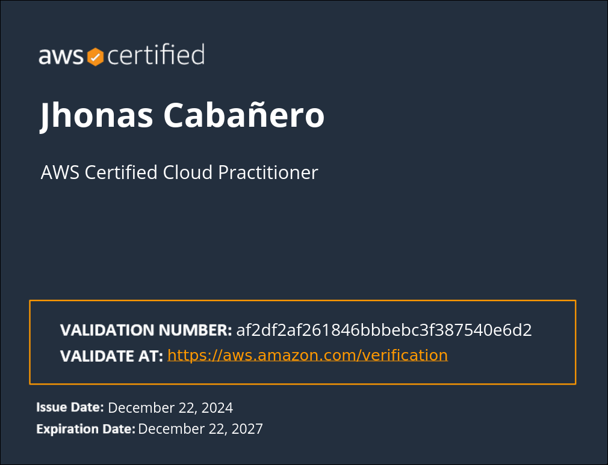
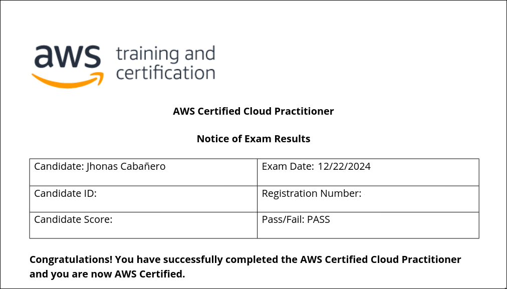

&nbsp;&nbsp;&nbsp;&nbsp;&nbsp;&nbsp;&nbsp;&nbsp;&nbsp;&nbsp;Before I took the exam, I questioned myself, <b><i>“Is this the path I really want to take? is AWS really fueled my passion aside from building computer? Am I the person in the future happily building EC2 Instance and forgot on other AZ? then after month, you check your management console you have 100$ or more that needs to settle? am I the person in the future enjoys configuring VPC, route table and build IaaC? “ </b></i> the answer still unknown but pretty sure, configuring and building are the things I love to do.  

&nbsp;&nbsp;&nbsp;&nbsp;&nbsp;&nbsp;&nbsp;&nbsp;&nbsp;&nbsp;Now, the journey starts. Research what AWS is. The cloud provider one not the shopping site. Then I realized, <b><i>IT WAS BROAD</i></b> than building computer that you just put hardware on computer chassis viola you have computer readily use. While researching, I found AWS Cloud Quest: Cloud Practitioner. It’s an interactive game that lets you do real world problem and uses AWS to resolve it. I tried it and enjoyed it.  

&nbsp;&nbsp;&nbsp;&nbsp;&nbsp;&nbsp;&nbsp;&nbsp;&nbsp;&nbsp; After I Passed the Cloud quest, I quickly jumped on <b><i>Stephane Maarek’s</b></i> Course. That’s the time that I need to do some deep learning as the course is all foundational and it’s new to me. Yes it’s difficult to understand at first. I also understand that there are two types of scaling. The instance type, what’s the importance of Cloud Adaption Framework, Well Architected Framework, Billings work and Security inside AWS works. And reading AWS whitepapers while watching Stephane’s course. This also includes hands on Simulearn.

&nbsp;&nbsp;&nbsp;&nbsp;&nbsp;&nbsp;&nbsp;&nbsp;&nbsp;&nbsp;Then go on <b><i>Tutorials Dojo</b></i> to get their Practice Exam. The first time I tried to practice man it was devastating. I didn’t even pass 20 / 65. then it progress while practicing. Checking where domain I am lack at then go at Stephane’s course to quick back on topic he discuss and read whitepaper. After weeks of repeating same step, I got 80–85% score on practice exam. That’s the time I schedule my exam. I used Pearson Vue online as exam center is really far on our hometown.

&nbsp;&nbsp;&nbsp;&nbsp;&nbsp;&nbsp;&nbsp;&nbsp;&nbsp;&nbsp;Before the day of exam, I do more Practice exam and I passed it!.  

&nbsp;&nbsp;&nbsp;&nbsp;&nbsp;&nbsp;&nbsp;&nbsp;&nbsp;&nbsp;Here’s the domain that needs to pass:  
&nbsp;&nbsp;&nbsp;&nbsp;&nbsp;&nbsp;&nbsp;&nbsp;&nbsp;&nbsp;Domain 1: Cloud Concepts 24%  
&nbsp;&nbsp;&nbsp;&nbsp;&nbsp;&nbsp;&nbsp;&nbsp;&nbsp;&nbsp;Domain 2: Security and Compliance 30% 
&nbsp;&nbsp;&nbsp;&nbsp;&nbsp;&nbsp;&nbsp;&nbsp;&nbsp;&nbsp;Domain 3: Cloud Technology and Services 34% 
&nbsp;&nbsp;&nbsp;&nbsp;&nbsp;&nbsp;&nbsp;&nbsp;&nbsp;&nbsp;Domain 4: Billing, Pricing, and Support 12% 
&nbsp;&nbsp;&nbsp;&nbsp;&nbsp;&nbsp;&nbsp;&nbsp;&nbsp;
AWS Certified Cloud Practitioner - Certification
&nbsp;&nbsp;&nbsp;&nbsp;&nbsp;&nbsp;&nbsp;&nbsp;&nbsp;
AWS Certified Cloud Practitioner Exam Result   
Next Certification is Solutions Architect -  Associate -> Terraform Associate.